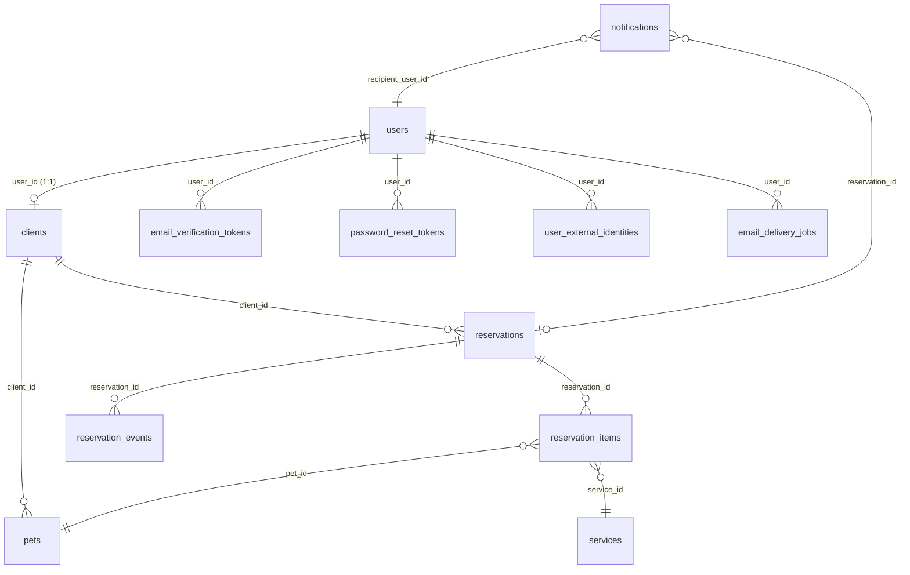

# AmiDog Data Model

This document describes the persistent entities of the AmiDog backend. All
entities are JPA mappings over the PostgreSQL schema managed by the Flyway
migrations `V1`–`V9`. IDs are database-generated identities; every row that is
modified carries a `@Version` optimistic-locking column; `created_at` /
`updated_at` are `Instant` timestamps.

## Entity map

| Entity | Table | Package |
| --- | --- | --- |
| `UserAccount` | `users` | `com.amidog.app.auth` |
| `Client` | `clients` | `com.amidog.app.client` |
| `Pet` | `pets` | `com.amidog.app.client` |
| `Reservation` | `reservations` | `com.amidog.app.reservation` |
| `ReservationItem` | `reservation_items` | `com.amidog.app.reservation` |
| `ReservationEvent` | `reservation_events` | `com.amidog.app.reservation` |
| `EmailDeliveryJob` | `email_delivery_jobs` | `com.amidog.app.auth` |
| `EmailVerificationToken` | `email_verification_tokens` | `com.amidog.app.auth` |
| `PasswordResetToken` | `password_reset_tokens` | `com.amidog.app.auth` |
| `UserExternalIdentity` | `user_external_identities` | `com.amidog.app.auth` |
| `Notification` | `notifications` | `com.amidog.app.notification` |
| `WeeklyAvailability` | `weekly_availability` | `com.amidog.app.scheduling` |
| `AvailabilityBlock` | `availability_blocks` | `com.amidog.app.scheduling` |
| `ServiceOffering` | `services` | `com.amidog.app.catalog` |

## Relationship diagram



`weekly_availability`, `availability_blocks`, and `services` have no foreign
keys; they are referenced only by value (and, for `services`, by
`reservation_items.service_id`).

---

## UserAccount — `users`

The authentication account. One user is either a `CLIENT` or the single
`ADMIN`. Emails are normalized (trimmed, lowercased) and unique.

| Field | Column | Notes |
| --- | --- | --- |
| `id` | `id` | identity |
| `emailNormalized` | `email_normalized` | unique, not null |
| `passwordHash` | `password_hash` | `{bcrypt}`-prefixed hash |
| `emailVerifiedAt` | `email_verified_at` | null until verified |
| `accountType` | `account_type` | `AccountType.CLIENT \| ADMIN` |
| `enabled` | `enabled` | false until email verified |
| `createdAt` / `updatedAt` | `created_at` / `updated_at` | |
| `version` | `version` | `@Version` |

**Relationships**
- **1:1 → `Client`** — at most one client profile per user (`clients.user_id` is unique).
- **1:N ← tokens** — `EmailVerificationToken`, `PasswordResetToken` (both `user_id`).
- **1:N ← identities** — `UserExternalIdentity`.
- **1:N ← delivery** — `EmailDeliveryJob`.
- **1:N ← notifications** — `Notification.recipient` (`recipient_user_id`).

**Invariants**
- Exactly one `ADMIN` account can exist (enforced by a unique partial index).
- Client accounts start `enabled = false` and become enabled on email verification.

---

## Client — `clients`

The client profile, attached to a single user account.

| Field | Column | Notes |
| --- | --- | --- |
| `id` | `id` | identity |
| `user` | `user_id` | 1:1, unique, not null |
| `name` | `name` | not null |
| `phone` | `phone` | not null |
| `active` | `active` | soft-deactivate flag |
| `createdAt` / `updatedAt` | `created_at` / `updated_at` | |
| `version` | `version` | `@Version` |

**Relationships**
- **1:1 → `UserAccount`** (`user_id`).
- **1:N → `Pet`** (`clients.id` = `pets.client_id`).
- **1:N → `Reservation`** (`clients.id` = `reservations.client_id`).

**Invariants**
- Only accounts of type `CLIENT` can own a client profile (the admin has none).

---

## Pet — `pets`

A patient belonging to a client.

| Field | Column | Notes |
| --- | --- | --- |
| `id` | `id` | identity |
| `client` | `client_id` | not null |
| `name` | `name` | not null |
| `species` | `species` | not null |
| `breed` | `breed` | nullable |
| `birthdate` | `birthdate` | nullable |
| `active` | `active` | soft-delete flag |
| `createdAt` / `updatedAt` | `created_at` / `updated_at` | |
| `version` | `version` | `@Version` |

**Relationships**
- **N:1 → `Client`**.
- **1:N ← `ReservationItem`** (`pets.id` = `reservation_items.pet_id`).

**Invariants**
- A pet is archived (`active = false`) instead of being physically deleted when
  it still has reservations.

---

## Reservation — `reservations`

A booking for one client at a fixed 30-minute slot. One reservation can include
several pets/services through its items.

| Field | Column | Notes |
| --- | --- | --- |
| `id` | `id` | identity |
| `client` | `client_id` | not null |
| `scheduledStart` | `scheduled_start` | not null |
| `scheduledEnd` | `scheduled_end` | start + 30 min |
| `status` | `status` | `ReservationStatus` enum |
| `clientNote` | `client_note` | nullable, ≤ 500 chars |
| `createdAt` / `updatedAt` | `created_at` / `updated_at` | |
| `cancelledAt` | `cancelled_at` | set when cancelled |
| `cancelledBy` | `cancelled_by` | `CLIENT \| ADMIN` |
| `cancellationReason` | `cancellation_reason` | ≤ 300 chars |
| `version` | `version` | `@Version` |

**Relationships**
- **N:1 → `Client`**.
- **1:N → `ReservationItem`** — cascade + orphan removal, ordered by `id`.
- **1:N → `ReservationEvent`** — cascade + orphan removal, ordered by `createdAt, id`.
- **1:N ← `Notification`** (`reservation_id`, nullable).

**State machine**

```text
PENDING    -> CONFIRMED | CANCELLED
CONFIRMED  -> CANCELLED | COMPLETED | NO_SHOW
CANCELLED / COMPLETED / NO_SHOW  -> (terminal)
```

- Rescheduling is only allowed from `PENDING` or `CONFIRMED` and clears any
  cancellation data.
- Slot overlap is blocked at the database level (see migration `V9`).

---

## ReservationItem — `reservation_items`

A single pet + service booked inside a reservation. The service name is
snapshotted so historical reservations survive catalog renames.

| Field | Column | Notes |
| --- | --- | --- |
| `id` | `id` | identity |
| `reservation` | `reservation_id` | not null |
| `pet` | `pet_id` | not null |
| `service` | `service_id` | not null |
| `serviceNameSnapshot` | `service_name_snapshot` | denormalized copy of `services.name` |

**Relationships**
- **N:1 → `Reservation`**.
- **N:1 → `Pet`**.
- **N:1 → `ServiceOffering`**.

---

## ReservationEvent — `reservation_events`

Append-only audit trail of a reservation's lifecycle.

| Field | Column | Notes |
| --- | --- | --- |
| `id` | `id` | identity |
| `reservation` | `reservation_id` | not null |
| `eventType` | `event_type` | `ReservationEventType` string |
| `actorType` | `actor_type` | `ReservationActor` string |
| `previousStatus` | `previous_status` | nullable |
| `newStatus` | `new_status` | nullable |
| `previousStart` | `previous_start` | nullable |
| `newStart` | `new_start` | nullable |
| `reason` | `reason` | nullable, ≤ 300 chars |
| `createdAt` | `created_at` | not null |

**Relationships**
- **N:1 → `Reservation`**.

**Invariants**
- Events are never mutated; a new row is added on every status change,
  cancellation, or reschedule.

---

## EmailDeliveryJob — `email_delivery_jobs`

Durable outbox entry for transactional email (verification / password reset).
Drives retry with exponential backoff and lease fencing to avoid duplicate
deliveries across instances.

| Field | Column | Notes |
| --- | --- | --- |
| `id` | `id` | identity |
| `user` | `user_id` | not null |
| `deliveryType` | `delivery_type` | `VERIFICATION \| PASSWORD_RESET` |
| `state` | `state` | `PENDING \| PROCESSING \| COMPLETED` |
| `attempts` | `attempts` | delivery attempt counter |
| `nextAttemptAt` | `next_attempt_at` | not null |
| `leaseUntil` | `lease_until` | lease expiry |
| `deliveryFence` | `delivery_fence` | per-claim fencing token |
| `tokenHash` | `token_hash` | sha-256 hex (64 chars) of the linked token |
| `completedAt` | `completed_at` | |
| `createdAt` / `updatedAt` | `created_at` / `updated_at` | |

**Relationships**
- **N:1 → `UserAccount`**.

**Invariants**
- `tokenHash` must be exactly 64 lowercase hex characters.
- Completion/retry require a valid lease fence; retries back off exponentially
  (capped at 1 hour).

---

## EmailVerificationToken — `email_verification_tokens`

Single-use token proving ownership of the account email.

| Field | Column | Notes |
| --- | --- | --- |
| `id` | `id` | identity |
| `user` | `user_id` | not null |
| `tokenHash` | `token_hash` | unique, char(64) |
| `expiresAt` | `expires_at` | not null |
| `consumedAt` | `consumed_at` | null until used |
| `createdAt` | `created_at` | |

**Relationships**
- **N:1 → `UserAccount`**.

**Invariants**
- Only the SHA-256 hash is stored, never the raw token.
- Consumable only if unexpired and unconsumed.

---

## PasswordResetToken — `password_reset_tokens`

Single-use token for resetting a forgotten password.

| Field | Column | Notes |
| --- | --- | --- |
| `id` | `id` | identity |
| `user` | `user_id` | not null |
| `tokenHash` | `token_hash` | unique, char(64) |
| `expiresAt` | `expires_at` | not null |
| `consumedAt` | `consumed_at` | null until used |
| `createdAt` | `created_at` | |

**Relationships**
- **N:1 → `UserAccount`**.

**Invariants**
- Same single-use / hashed-storage rules as `EmailVerificationToken`.

---

## UserExternalIdentity — `user_external_identities`

Links a user account to an identity from an external provider (OAuth/SSO).

| Field | Column | Notes |
| --- | --- | --- |
| `id` | `id` | identity |
| `user` | `user_id` | not null |
| `provider` | `provider` | not null |
| `providerSubject` | `provider_subject` | provider-side subject, not null |
| `createdAt` | `created_at` | |

**Relationships**
- **N:1 → `UserAccount`**.

---

## Notification — `notifications`

In-app notification delivered to a user account (client or admin).

| Field | Column | Notes |
| --- | --- | --- |
| `id` | `id` | identity |
| `recipient` | `recipient_user_id` | not null |
| `type` | `type` | `NotificationType` enum |
| `title` | `title` | ≤ 120 chars |
| `body` | `body` | ≤ 500 chars |
| `reservation` | `reservation_id` | nullable link |
| `deduplicationKey` | `deduplication_key` | unique, ≤ 160 chars |
| `readAt` | `read_at` | null until read |
| `createdAt` | `created_at` | |

**Relationships**
- **N:1 → `UserAccount`** (recipient).
- **N:1 → `Reservation`** (optional context).

**Invariants**
- `deduplicationKey` guarantees the same notification is never created twice.

---

## WeeklyAvailability — `weekly_availability`

Recurring weekly opening hours for the clinic.

| Field | Column | Notes |
| --- | --- | --- |
| `id` | `id` | identity |
| `dayOfWeek` | `day_of_week` | 1 (Mon) – 7 (Sun) |
| `localStartTime` | `local_start_time` | `LocalTime` |
| `localEndTime` | `local_end_time` | `LocalTime` |
| `active` | `active` | whether the slot is bookable |

**Relationships**
- None (standalone table; consulted by the scheduling services).

**Invariants**
- `dayOfWeek` must be 1–7; `end` must be after `start`.

---

## AvailabilityBlock — `availability_blocks`

One-off blocking of the calendar (e.g., holidays, closure).

| Field | Column | Notes |
| --- | --- | --- |
| `id` | `id` | identity |
| `startAt` | `start_at` | `Instant`, not null |
| `endAt` | `end_at` | `Instant`, not null |
| `reason` | `reason` | nullable, ≤ 200 chars |
| `createdAt` | `created_at` | |

**Relationships**
- None.

**Invariants**
- `end` must be after `start`.

---

## ServiceOffering — `services`

A bookable service in the catalog, configured by the administrator.

| Field | Column | Notes |
| --- | --- | --- |
| `id` | `id` | identity |
| `code` | `code` | unique, ≤ 60 chars |
| `name` | `name` | ≤ 100 chars |
| `description` | `description` | nullable, ≤ 500 chars |
| `active` | `active` | soft-delete flag |
| `displayOrder` | `display_order` | ordering hint |
| `createdAt` / `updatedAt` | `created_at` / `updated_at` | |
| `version` | `version` | `@Version` |

**Relationships**
- **1:N ← `ReservationItem`** (`services.id` = `reservation_items.service_id`).

**Invariants**
- `code` is unique and normalized; archived services are hidden rather than deleted.

---

## Enums

| Enum | Values | Used by |
| --- | --- | --- |
| `AccountType` | `CLIENT`, `ADMIN` | `UserAccount.accountType` |
| `ReservationStatus` | `PENDING`, `CONFIRMED`, `CANCELLED`, `COMPLETED`, `NO_SHOW` | `Reservation.status`, `ReservationEvent` |
| `ReservationEventType` | `CREATED`, `STATUS_CHANGED`, `CANCELLED`, `RESCHEDULED` | `ReservationEvent.eventType` |
| `ReservationActor` | `CLIENT`, `ADMIN` | `ReservationEvent.actorType`, `Reservation.cancelledBy` |
| `NotificationType` | `NEW_RESERVATION`, `CLIENT_CANCELLED`, `CLIENT_RESCHEDULED`, `RESERVATION_CONFIRMED`, `ADMIN_CANCELLED`, `ADMIN_RESCHEDULED`, `APPOINTMENT_REMINDER` | `Notification.type` |
| `EmailDeliveryType` | `VERIFICATION`, `PASSWORD_RESET` | `EmailDeliveryJob.deliveryType` |
